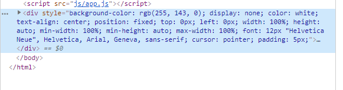

# FSJS_techdegree_P5
LIVE LINK: https://bosris.github.io/FSJS_techdegree_P5/

BUG NOTICE: Github adds a div to the end of the projects when hosted on Github pages. 

Fix 1: You can click any card on a person, click the next button, the background should go black, hit exit on the modal view, then exit again on the modal view. Program should work fine now.

Fix 2: On load delete the very last div with the style of "style="background-color: rgb(255, 143, 0);" etc. 

Heres a pic for fix 2: 

